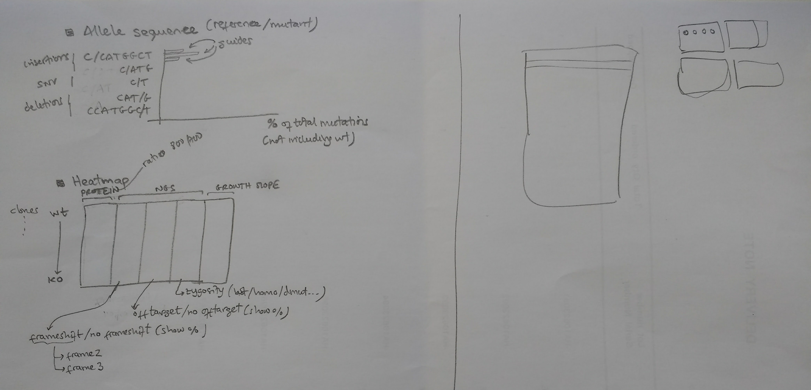

# NGS Downstream processing and plotting

## Result table, one per sample

- Protein data as main score
- Base calculation on allele frequency, distance does not matter much

* Group them by sample
* If off target - down score strongest down
* If allele fraction between 0.4 0.6 for two of them

### zygosity column (and zygosity description in separate table?)

Use calczygosities function in NGS_plot.R script
Only work for two alleles - if more marked as more than 2 alleles
Filter out completely 0.15 now added into the pipeline

This function assesses the sample to decide whether their mutations are:
- homozygous (homo),
- one allele 'mutant' and the other a different mutant (muthet), or
- one allele mutant and the other wild-type (mutwt).
This may need to be adapted for cases with >2 alleles.

in the range of the amplicon, calculated per caller:
- 'homo' = allele_fraction > 0.85        & nb_row == 1 same mutation on both chromosomes
- 'smut' = 0.35 < allele_fraction < 0.85 & nb_row == 1 single mutation: mutation on only one chromosome, none on the other
- 'dmut' = 0.35 < allele_fraction < 0.85 & nb_row == 2 double mutations: different mutation on each chromosome
- 'iffy' = full of uncertainty, for all others cases that are uncertain

NOT FOR NOW:- 'mult' =                                 nb_row > 2  multiple alleles: more than two rows
Category for each variant callers, and only looks at indels

### has_off_target column

gene not the target or position outside the range of the amplicon
- 'offt' = offtargets                                  mutation off target

### mutation_type column
join consequence from different rows of same sample
create 4 or more letters code for consequence:
- see fun.NGS_plotvariants

Create a result table for each sequencing sample

## Plots

### Indel ranges plot (Ruben)

issue with box size that needs to be calculated from position and indel length (positive: insertion with triangle bottom or negative: deletion with rectangle on top)

### Indel length distribution plot (On going)

per allele per variant caller
plotting percentage of indel_length based on cut site

See script `python/scripts/plot_distances_ongoing.py`

### Mutation plot (replace it by Allele plot) (Anne)

percentage of number of INDEL or SNV over total number of mutation found
info from type column, separated per guide (each guide has one colour)
per variant caller

three categories: SNV, Insertion (INDEL, positive), Deletion (INDEL, negative)

### Allele plot (Anne)

based on alleles column per caller and guide

### Variant plot (On going)

based on consequence
per allele over total number of mutation
per variant caller

See script `python/scripts/plot_typeofvariant_ongoing.py`

### Zygosity plot (Done)

per variant caller

See script `python/scripts/plot_zygosities.py`

### Plot diagrams

Plots are:
- 
- 
